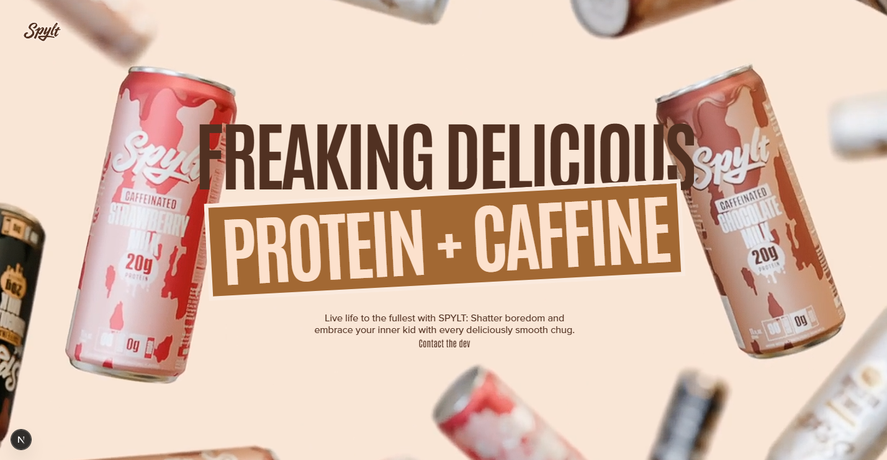

# Spylt Website Remake



This is a remake of the award-winning Spylt website, built with Next.js and GSAP. The original design and assets are from the Spylt website.

## 🌐 Live Demo

Check out the live deployment at [mohannad-spylt.vercel.app](https://mohannad-spylt.vercel.app/)

## 🛠️ Built With

- [Next.js](https://nextjs.org/) - React framework
- [GSAP](https://greensock.com/gsap/) - Animation library
- [TypeScript](https://www.typescriptlang.org/) - Type safety
- [Tailwind CSS](https://tailwindcss.com/) - Styling

## 🔧 Tech Stack

### Frontend

- React.js - UI Library
- Next.js - React Framework
- TypeScript - Programming Language
- GSAP - Animation Library
- Tailwind CSS - Utility-first CSS Framework

### Development Tools

- ESLint - Code Linting
- Prettier - Code Formatting
- Husky - Git Hooks
- PostCSS - CSS Processing

### Deployment

- Vercel - Hosting Platform

## 🎨 Features

- Smooth animations using GSAP
- Responsive design
- Interactive UI elements
- Video integration
- Modern loading transitions

## 🚀 Getting Started

### Prerequisites

- Node.js (LTS version)
- npm/yarn/pnpm/bun

### Installation

1. Clone the repository

```bash
git clone https://github.com/MohannadDev/Spylt.git
```

2. Install dependencies

```bash
npm install
# or
yarn install
# or
pnpm install
# or
bun install
```

3. Run the development server

```bash
npm run dev
# or
yarn dev
# or
pnpm dev
# or
bun dev
```

4. Open [http://localhost:3000](http://localhost:3000) with your browser to see the result.

## 📝 Credits

Design and assets are from the original Spylt website. This is a remake for demonstration and learning purposes.

## 👨‍💻 Developer

<div align="center">

### Mohannad Eldardeery

**Full Stack Developer | React Specialist | Animation Expert**

<p>
  <a href="https://github.com/MohannadDev" target="_blank"></a>
  <a href="https://www.linkedin.com/in/MohannadEldardeery/" target="_blank"></a>
  <a href="https://www.upwork.com/freelancers/~01880ecbdb24cd17c4" target="_blank"></a>
  <a href="mailto:mohannad.eldardeery@gmail.com" target="_blank"></a>
</p>

_Passionate about creating smooth, interactive web experiences with modern technologies_

</div>

## 📄 License

This project is for demonstration purposes only. All design rights belong to the original Spylt website creators.
